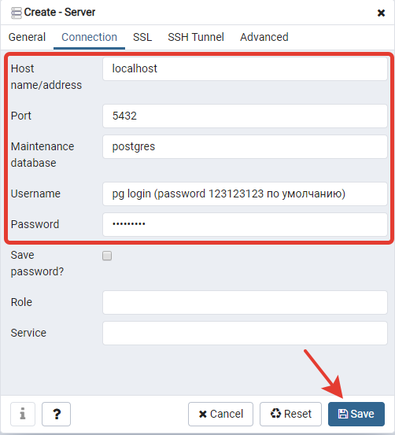
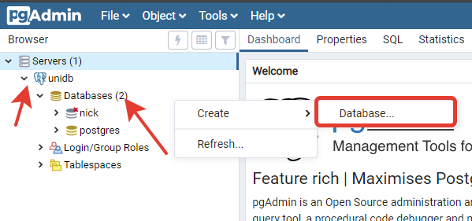
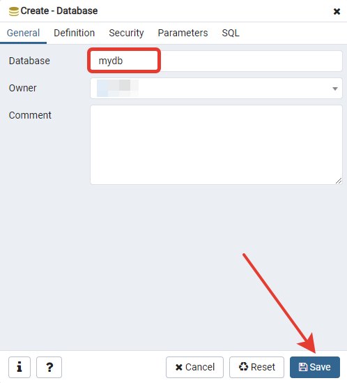
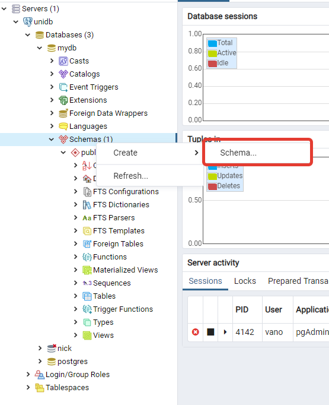
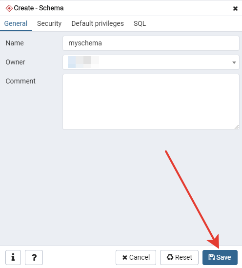

# Получение доступа

Зайдите на:

http://116.203.90.25

Данные приведены в таблице ниже, если кого-то упустил, то напишите

1 логин, чтобы зайти в pgAdmin (смените пароль). Он просто требует, чтоб логин был почтой, поэтому добавлено @gmail.com которое не несёт смысловой нагрузки

2 логин - доступ к базе (тоже смените пароль в Login/Group Roles)

Для всего стандартный пароль 123123123

| pgAdmin login                | pg login  |
|------------------------------|-----------|
| Toxi4@gmail.com              | toxi4     |
| MikeSaltykov07@gmail.com     | saltykov  |
| 0muga@gmail.com              | 0muga     |
| IgorPankov1999@gmail.com     | pankov    |
| pappyOX@gmail.com            | pappyox   |
| Morsala@gmail.com            | morsala   |
| AlexandraVasiljeva@gmail.com | vasiljeva |
| g0dzZz1lla@gmail.com         | melnikov  |
| Stepander@gmail.com          | stepander |
| MrDmV@gmail.com              | mrdmv     |
| tr00per4@gmail.com           | tr00per4  |
| Vano97@gmail.com             | vano      |
| GWNBLD@gmail.com             | gwnbld    |
| Artem55555@gmail.com         | artem     |
| Kurukadi@gmail.com           | kurukadi  |
| inekit@gmail.com             | inekit    |
| AsyaTsy@gmail.com            | tsy       |
| fvrrrn@gmail.com             | fvrrrn    |

После успешного входа в pgAdmin подключитесь к серверу:

введите название,

- host: localhost 
- port: 7777
- username: pg login (из таблицы)
- password: по умолчанию 123123123, смените

Создайте свою новую базу данных

Внутри созданной базы данных создайте схему

Теперь вы можете создавать таблицы, писать запросы - поиграйте, разберитесь с интерфейсом.

