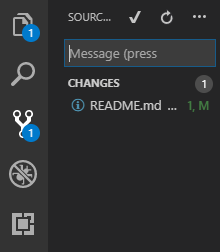

# Visual Studio Code (VSC)

Божественный [open source](https://github.com/Microsoft/vscode) редактор кода. Основан на [Electron](https://github.com/electron/electron), который в свою очередь крутится на [Node.Js](https://nodejs.org/en/).

Из-за открытого исходного кода огромное количество человек участвует в разработке данного ПО (757 человек внесли свой вклад в настоящий момент). Редактор обновляется каждый месяц и разработчики добавляют огромное количество полезных функций каждый месяц.

Одно из преимуществ - легковестность. Кроме того у VSC есть возможность создавать собственные расширения, поэтому можно найти расширения на все случаи жизни.

Особенно хорош этот редактор для web-разработки. О нужных и полезных расширения ниже и пойдёт речь. Используется англоязычная версия.

## Использование git

В visual studio code легко работать с репозиторием 

В выделенном элементе находится возможность отправки коммитов.

Если были внесены какие-то изменения и сохранены, то увидите следующую картину:

Чтобы утвердить эти изменения локально - нужно зайти в source control, ввести сообщение, сообщающее о том, что было сделано в этом коммите и отправить (ctrl+enter).

Коммит сохранен локально, чтобы отправить его в удалённые репозиторий (например, bitbucket) необходимо нажать снизу на данную кнопку (если вы только склонировали репозиторий и внесли свои первые изменения, то там будет немного другой значок publish - нажать на него.

В случае, если в репозиторий были сделаны какие-то изменения на другом ПК, то можно нажать туда же, где и отправляете коммит - и принять. Либо в терминале (ctrl+`) или view - terminal ввести git fetch. В таком случае слева будет показано, сколько коммитов не было принято (если такие есть).

## Расширения

Существует множество полезных расширений для visual studio code. Для установки слева необходимо выбрать Extensions и найти нужное. В каждом расширении есть подробная информация о использовании. Вам обязательно пригодится:

### [REST Client](https://marketplace.visualstudio.com/items?itemName=humao.rest-client)

Позволяет отправлять get, post, put, delete запросы

### [Live Server](https://marketplace.visualstudio.com/items?itemName=ritwickdey.LiveServer)

Позволяет создать локальный сервер для конкретных файлов. При сохранении изменений в файле моментально изменяет и вид страницы в браузере.

Примечание: возможно после установки и перезагрузки придётся закрыть и заново открыть visual studio code, если не появилось ничего.

### [Prettier](https://marketplace.visualstudio.com/items?itemName=esbenp.prettier-vscode)

Автоматически форматирует код. В описании указано много различных настроек. Можно поставить форматирование кода при сохранении (по нажатию на ctrl+s). Для этого необходимо зайти в file - preferences - setting. Найти настройку editor.formatOnSave и поставить true.

### [Bracket Pair Colorizer](https://marketplace.visualstudio.com/items?itemName=CoenraadS.bracket-pair-colorizer)

Разукрашивает скобки в разные цвета, очень удобно для просмотра кода.

### [ESLint](https://marketplace.visualstudio.com/items?itemName=dbaeumer.vscode-eslint)

Смотрит на код и проверяет правильно ли написан код в соответствии с паттернами ECMAScript/JavaScript.

### [GitLens](https://marketplace.visualstudio.com/items?itemName=eamodio.gitlens)

Удобное расширения для работы с git.

### [Indent-rainbow](https://marketplace.visualstudio.com/items?itemName=oderwat.indent-rainbow)

Подсвечивает отступы

### [javascript console utils](https://marketplace.visualstudio.com/items?itemName=whtouche.vscode-js-console-utils)

Позволяет удобно вставлять console.log для конкретных переменных.

### [Quokka.js](https://marketplace.visualstudio.com/items?itemName=WallabyJs.quokka-vscode]

Позволяет запускать js код в real-time

